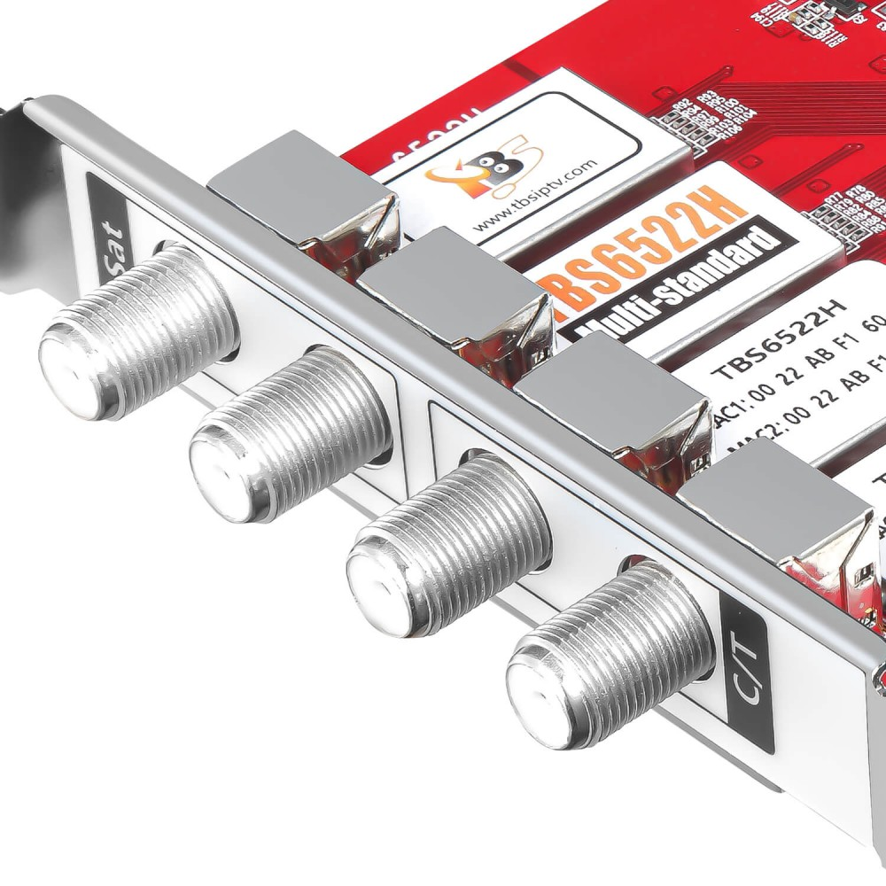
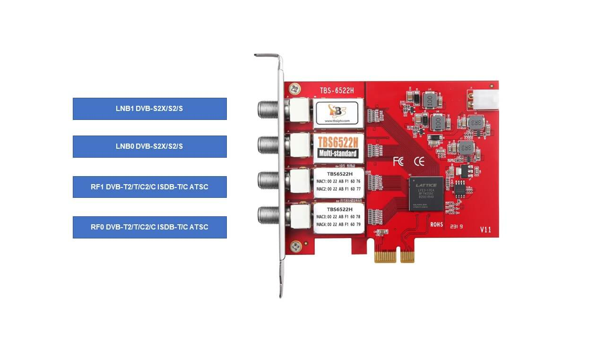
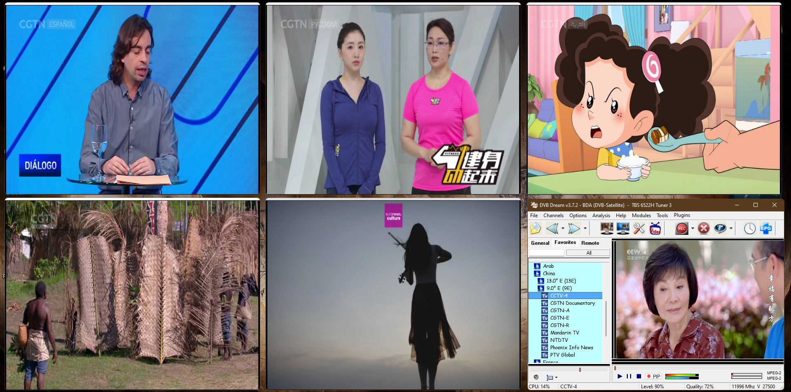

# Testing Free To Air TV with the TBS6522H Multi-standard quad tuner

Those who are often on the road cannot ignore it, many houses and apartments are equipped with satellite dishes and/or antennas for watching TV. 
Nowadays there are many ways to watch Digital Television.

The choice of the best technology depends on your individual needs and preferences, but also on the
availability and technological infrastructure in the area where you live.

It goes without saying that there are many alternatives available, these can also be combined and
respond to everyone's viewing behavior with the new <a href="https://www.tbsiptv.com/tbs6522h-multi-standard-quad-2sat-2ter-or-cable-tuner-pci-e-card">6522H Quad TV tuner PCI express card from TBS.
</a> 

 
          
Supporting multiple digital TV standards including DVB-S2X/S2/S/T2/T/C2/C (J.83A/B/C)/ISDB-
T/C /ATSC1.0, and dual DVB-S2X/S2/T2/T/C2/C standard at the same time.

 

TBS6522H quad tuner enables you to easily watch TV up to 8 additional channels or record other channels at
the same time and much easier switching between different digital TV signals.

As a result, TBS6522H Quad tuner offers a unprecedented wider range of multiple digital TV
standards, making many TV channels available, including international channels and special interest
channels from all over the world, even in places where there is no cable connection. 

As a TV Viewer application DVBDream is used with the PIP function on 1 tuner. 

 

 

Pip Function on all 4 tuners DVB-S2/T2.

## Installation

Youtube: What is TBS6522H and How to install it into PC

Youtube: How to use TBS6522H under Windows & how to use TBS change mode tool

<a href="https://www.tbsiptv.com/tbs6522h-multi-standard-quad-2sat-2ter-or-cable-tuner-pci-e-card">TBS6522H Windows DVBS/S2 + DVBT/T2/C/ISDBT Drivers </a> 

## Todo streamreader RF/IQ Scan:

AV2018 read  error! Check your i2c implementation and/or i2c address for the AV2018!! 
Terrestrial tuner HW init error! 

Turbosight Si2183 direct control used ! 
TBS_SI2183_HWInit() : Initialization failed ! 
Unspecified error 

Turbosight (Lattice FPGA based) BDA extension used ! 
Turbosight BlindScan support with SiLabs 
Turbosight I2C access support 
Turbosight SignalEx support 
Turbosight SignalInfo support 
Turbosight MIS filtering support 
Turbosight PLS control support 
Turbosight MODCODE filtering support 
Turbosight fast LNB control support 

## Disclaimer

This website is for educational purpose only. 

## Author

- [TBS6522H by Happysat](https://github.com/happysat/)

